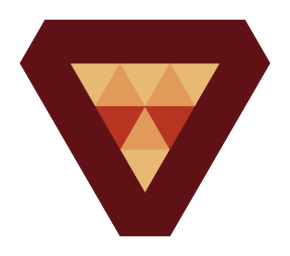
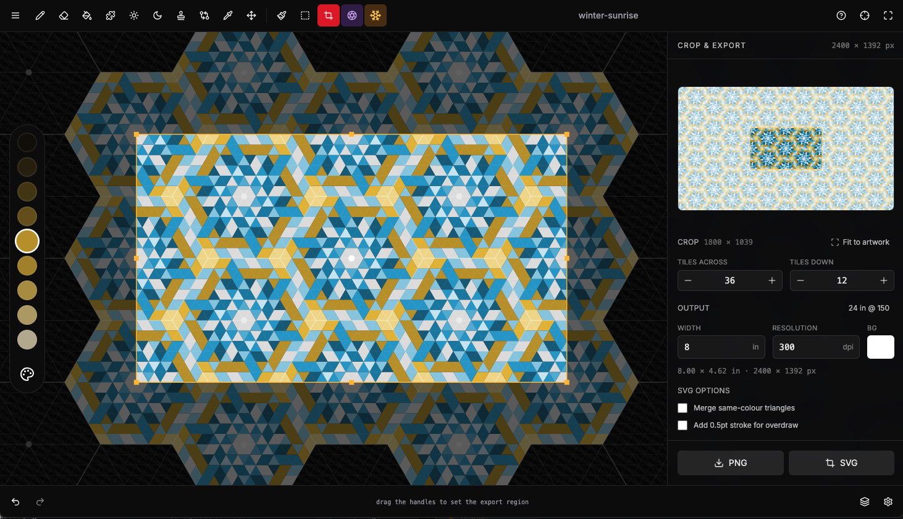

<p align="center">
  
</p>

<h1 align="center">Trixel</h1>

<p align="center">
  An infinite triangular-grid drawing tool for the browser.<br>
  Paint on a tessellation of triangles with hex lattices, radial symmetry, layers, and stamps.
</p>

<p align="center">
  
  
  
  
</p>

<p align="center">
  <a href="https://neurofuzzy.github.io/trixelart/"><b>▶ Try the LIVE DEMO</b></a>
</p>

---

## About

**Trixel** is a client-side pixel-art-style editor where the "pixels" are triangles. The grid is
infinite and pannable, everything is rendered on a DPR-aware HTML5 canvas, and your work autosaves
to the browser. It runs entirely offline — there's no backend and no account — and installs to your
home screen as a full-screen PWA.

<p align="center">
  
</p>

## Features

- **Infinite triangular canvas** — pan and zoom across an unbounded trixel grid.
- **A full toolset** — Paint, Erase, Move, Select, Stamp, Clone, Dodge, Burn, and Eyedropper.
- **Layers** — add, reorder, duplicate, and toggle visibility.
- **Hex lattice modes** — overlay a flat-top or pointy-top honeycomb with adjustable divisions.
- **Radial symmetry & flowers** — mirror strokes with 60°/120° rotational symmetry and hex-flower repeats.
- **Selections & stamps** — capture the contents of a hex as a reusable stencil, then stamp or transform it (rotate, flip, palette-shift).
- **Palettes** — multiple color palettes with live hue/saturation offsets.
- **Undo/redo** with autosave to `localStorage`.
- **Example projects** — open a finished piece from the splash screen or the menu and paint over it.
- **Import/export** — projects save as `.trixel.svg`: a real SVG that draws your artwork, so it previews in Finder, with the project data embedded inside it. Older `.json` projects still load. Finished art exports as **SVG**, and there are dedicated exports for fabric, 3D printing, cutting and pen plotters.
- **Touch & stylus ready** — pinch-to-zoom, two-finger pan, and installable to your home screen.

## Getting started

```bash
git clone https://github.com/neurofuzzy/trixelart.git
cd trixelart
npm install
npm run dev
```

Then open **http://localhost:9002**.

### Scripts

| Script | Description |
| --- | --- |
| `npm run dev` | Start the dev server (Turbopack) on port 9002 |
| `npm run build` | Production build |
| `npm run start` | Serve the production build |
| `npm run lint` | Lint with ESLint |
| `npm run typecheck` | Type-check with `tsc --noEmit` |
| `npm run map` | Regenerate `CODEMAP.md` |

## Keyboard shortcuts

| Key | Action |
| --- | --- |
| `P` / `E` / `H` | Paint · Erase · Move |
| `S` / `T` | Select · Stamp |
| `1`–`9` | Pick color + switch to Paint |
| `R` / `Shift+R` | Rotate selection 60° CW / CCW |
| `↑` / `↓` | Shift colors lighter / darker |
| `←` / `→` | Cycle each trixel's palette back / forward |
| `Ctrl+Z` / `Ctrl+Shift+Z` | Undo / Redo |
| `Esc` | Clear selection |
| `Delete` / `Backspace` | Clear selected hex contents |

## Install to your device

Trixel ships as a Progressive Web App. On iPad/iPhone Safari, tap **Share → Add to Home Screen**;
on Android/Chrome, use **Install app**. It launches full-screen with no browser chrome.

## Tech stack

- **[Next.js 15](https://nextjs.org/)** (App Router) + **React 19** + **TypeScript**
- **Tailwind CSS v3** and **[shadcn/ui](https://ui.shadcn.com/)** components
- **HTML5 Canvas** with device-pixel-ratio scaling — no drawing libraries
- No backend; state persists in `localStorage`

See **[CLAUDE.md](CLAUDE.md)** for an architecture overview, **[docs/](docs/)** for the
design notes behind each area, and **[CODEMAP.md](CODEMAP.md)** for an
auto-generated source map.

## Contributing

Issues and pull requests are welcome. Before opening a PR, please run:

```bash
npm run typecheck && npm run lint
```

## License

Released under the [MIT License](LICENSE).
